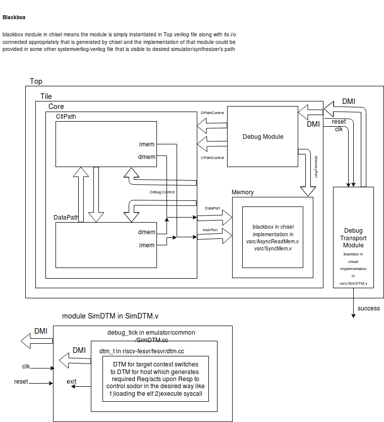

[Click Here](https://www.draw.io/?title=overview.xml&url=https://raw.githubusercontent.com/librecores/riscv-sodor/master/doc/overview.xml) to edit this image in browser. Please submit a Pull Request if your modified xml represents more accurate information

The above image shows the data/control flow that applies to emulator binaries that are built from directories [emulator/rv32_1stage](https://github.com/librecores/riscv-sodor/tree/master/emulator/rv32_1stage) [emulator/rv32_2stage](https://github.com/librecores/riscv-sodor/tree/master/emulator/rv32_2stage) [emulator/rv32_3stage](https://github.com/librecores/riscv-sodor/tree/master/emulator/rv32_3stage) [emulator/rv32_5stage](https://github.com/librecores/riscv-sodor/tree/master/emulator/rv32_5stage) [emulator/rv32_ucode](https://github.com/librecores/riscv-sodor/tree/master/emulator/rv32_ucode) of all branches

In all the configurations, the binaries are loaded into the processor's memory using the following sequence 

* Configure system bus control and status (sbcs) register to set AUTOINCREMENT i.e. increment the address in sbaddress register on every access of sbdata0  
* Write the address where the binary is to be loaded into sbaddress  
* Write data i.e. binary in 32-bit chunks to the sbdata0 

After the binary is loaded, a [write](https://github.com/codelec/riscv-fesvr/blob/master/fesvr/dtm.cc#L499) to 0x44(NON-STANDARD) is performed to pull sodor out of reset. 0x48(NON-STANDARD) is used to put sodor into reset. These are the only two non-standard address used from DMI address space in the current implementation of debug module in sodor.  

For more details on debug standard [LINK](https://static.dev.sifive.com/riscv-debug-spec-0.13.f7f3277.pdf)

DMI - Debug Module Interface 

DTM - Debug Transport Module