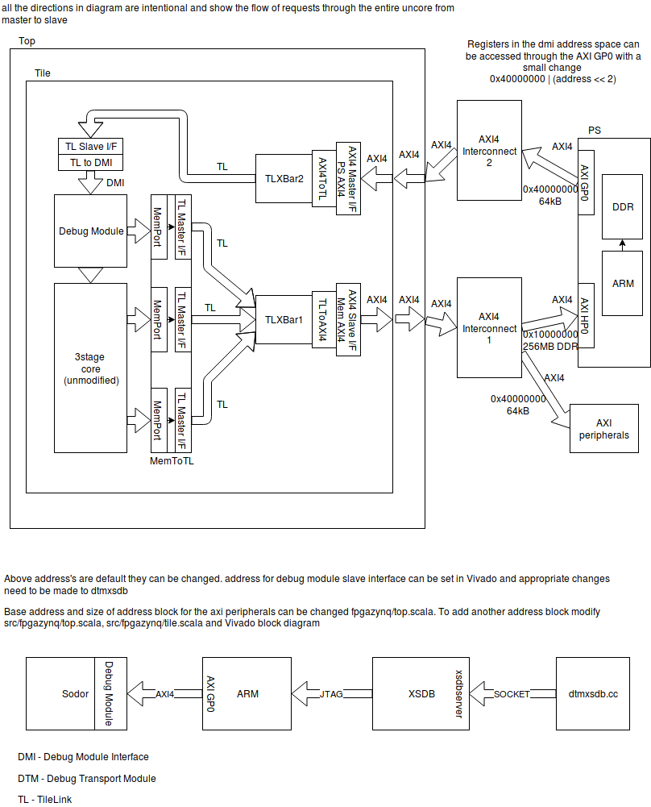

[Click Here](https://www.draw.io/?title=fpga.xml&url=https://raw.githubusercontent.com/librecores/riscv-sodor/tilelink2_fpga/doc/pynq.xml) to edit this image in browser. Please submit a Pull Request if your modified xml represents more accurate information

PYNQ-Z1 has Zynq Soc which contains Dual Cortex A9(PS) + Programmable Logic(~50KLUTs) and can be availed at $65 after academic discount. Designs created with PYNQ-Z1 are compatible with [Arty Z7](http://store.digilentinc.com/arty-z7-apsoc-zynq-7000-development-board-for-makers-and-hobbyists/) with no modifications to the bitstream.
